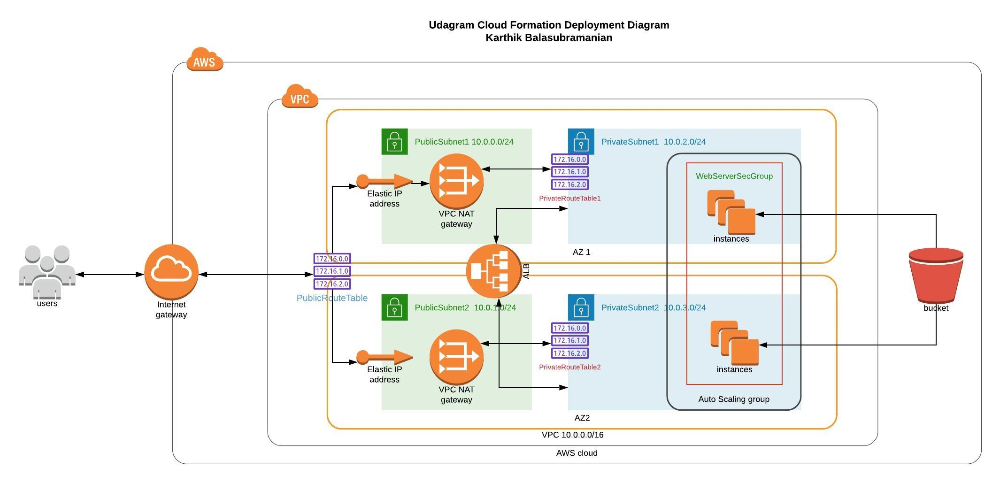

## Udagram Cloudformation Architecture Map



## Steps

1. Create an IAM policy for EC2 Servers to have read-only access to S3 servers. Name it as `UdacityS3ReadOnlyEC2`
2. Follow the steps to create infra and servers.
   ```
     bash create.sh ourudagraminfra ourinfra.yml ourinfra-params.json
   ```
   ```
     bash create.sh ourservers servers.yml server-parameters.json
   ```
3. Follow the steps to delete the created stack

   ```
     bash delete.sh ourservers
   ```

   ```
     bash delete.sh ourinfra
   ```
